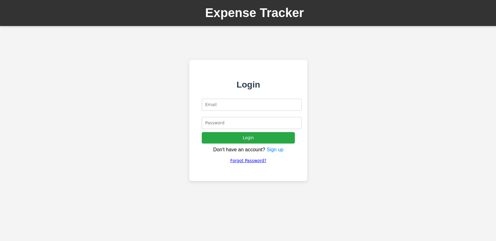
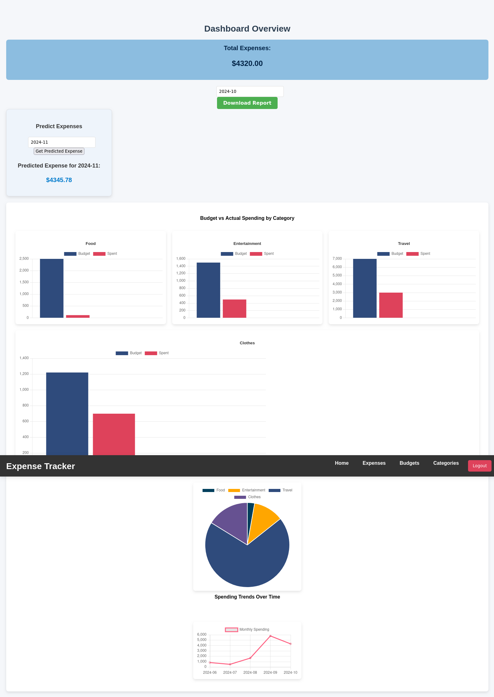
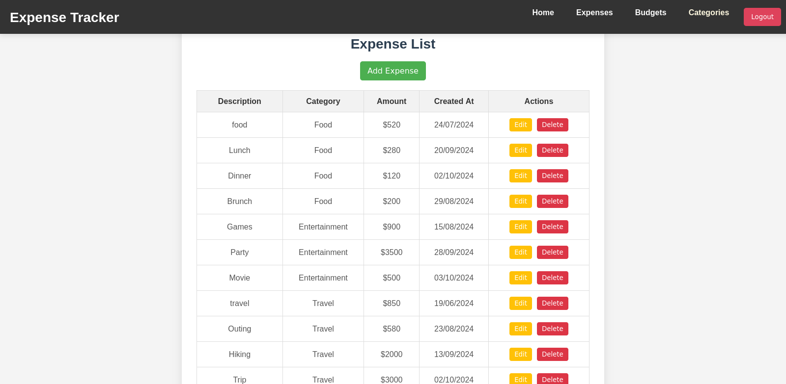
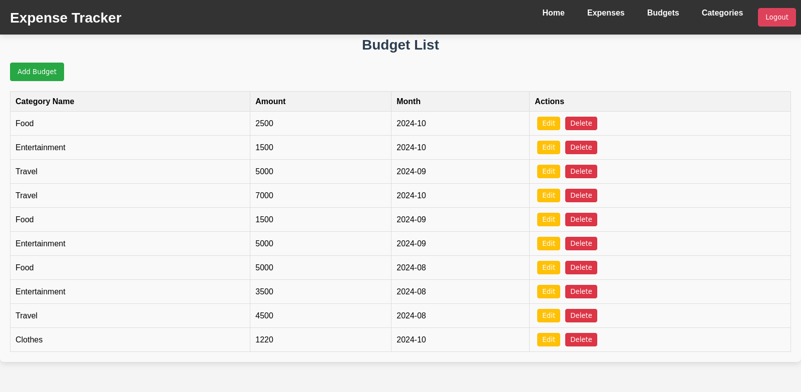
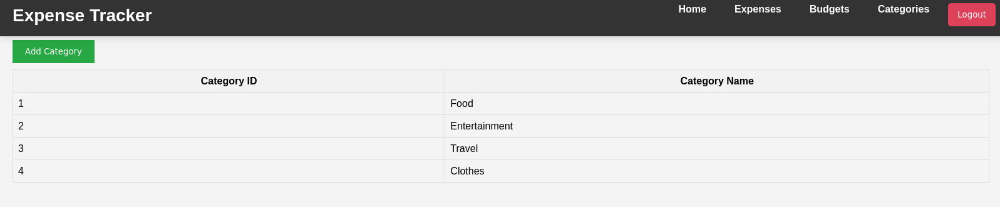

# Expense Tracker

An advanced Expense Tracker application built with React.js, Node.js, and PostgreSQL, designed for tracking daily expenses, managing budgets, generating reports, and visualizing spending trends.

## Table of Contents
1. [Features](#features)
2. [Tech Stack](#tech-stack)
3. [Installation](#installation)
4. [Configuration](#configuration)
5. [API Documentation](#api-documentation)
6. [Usage](#usage)
7. [Screenshots](#screenshots)
8. [Testing](#testing)
9. [Upcoming Features](#upcoming-features)

---

## Features

### Authentication
- **Signup/Login** with JWT-based authentication.
- **OTP-based Password Reset**: Users can reset passwords with OTP verification sent via email.

### Expense Management
- **Track Daily Expenses**: Log daily expenses with details such as description, category, and amount.
- **Budgeting**: Set monthly budgets to monitor spending.
- **Overspending Alerts**: Prompted if the user exceeds the budget.
- **Attach Receipts**: Add receipts to expense records (planned feature).

### Dashboard
- **Data Visualization**: Insightful charts and graphs showing spending trends.
- **Monthly Selector**: Date picker for month-year selection to view monthly expenses.

### Reporting
- **Monthly Reports**: Generate reports on expenses.
- **Predictive Analytics**: Predict next month’s expenses based on historical data using linear regression.

### Additional Features
- **Data Backup/Export**: Export data for backup and reporting.
- **Responsive UI**: Mobile-friendly design for seamless use across devices.

## Tech Stack

**Frontend**
- React.js
- Redux for state management
- Axios for API requests
- Chart.js for data visualization

**Backend**
- Node.js with Express.js
- JWT for authentication
- Axios for HTTP requests

**Database**
- PostgreSQL


## Installation

1. **Clone the Repository**

   ```bash
   git clone https://github.com/your-username/Expense_tracker.git
   cd Expense_tracker
2. **Install Dependencies**

   - Backend: Navigate to the backend directory and install dependencies.

    ```bash
    cd backend
    npm install

  - Frontend: Navigate to the frontend directory and install dependencies.

    ```bash
    cd ../frontend
    npm install

3. **Set up PostgreSQL Database**
   -  Create a PostgreSQL database named expense_tracker (or use the name specified in your .env file).

4. **Environment Variables**
   -  Add a .env file in both backend and frontend directories with the following variables:

### Backend (`backend/.env`)

    ```plaintext
        PORT=5000
        DATABASE_URL=postgresql://<user>:<password>@localhost:5432/expense_tracker
        JWT_SECRET=<your-jwt-secret>
        SMTP_EMAIL=<your-email>
        SMTP_PASSWORD=<your-email-password>

### Frontend (frontend/.env)
     

    ```plaintext
    REACT_APP_API_BASE_URL=http://localhost:5000/api

5. Run the Application
  - Backend: Start the backend server.

    ```bash
    cd backend
    npm start
    
  - Frontend: Start the frontend React application.
    ```bash
    cd ../frontend
    npm start

## API Documentation

-API documentation is available in swagger.js. To view the Swagger documentation:
  - Navigate to https://app.swaggerhub.com/apis/DarshanV/expense-tracker_api/1.0.0 in your browser.

## Usage

   - Sign up or Log in to access the application.
   - Navigate to Dashboard to view a summary of expenses, set budgets, and track spending.
   - Add New Expenses by filling out the form on the Expenses page.
   - Generate Reports to view spending trends and predictive insights.
## Screenshots

### Login/Signup


### Dashboard


### Expense Entry Form


### Budget Page


### Category Page


## Upcoming Features

   - Receipt Attachment: Upload and attach receipts to expenses.
   - Enhanced Predictive Analytics: Use additional machine learning models to improve expense predictions.
   - Improved Reporting: Export reports in various formats (PDF, Excel).
   - Mobile App Integration: Build a React Native app for mobile access.

This application aims to simplify daily expense tracking an
